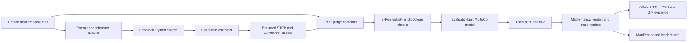

# Architecture and trust boundaries

## Data flow

The host controls inference, provenance and scheduling. A candidate container executes generated
Python with a small CAD SDK. A **new container**, built from a separate image, imports only geometry
and a trusted task. Python objects, pickle, candidate XML and executable files never cross into
the judge. The candidate image excludes the reference designs, task generator and judge modules.

The candidate must return `submission.json` and the named `.step` files. The host validates a
bounded manifest, copies only these regular files into a new judge input directory and adds its
own `task.json`. The input is mounted read-only. No output directory is mounted writable from
the host into either container.

## Modules

| Module | Responsibility | Trust |
| --- | --- | --- |
| `schema.py` | Finite, bounded schemas; unknown fields rejected | Trusted definitions |
| `tasks.py` | Stable seed-to-contract generator | Trusted task author |
| `sdk.py` | Parametric convex solids and STEP export | Candidate convenience, independently checked |
| `geometry.py` | Native STEP parsing, validity, coverage and clearance | Isolated judge |
| `physics.py` | XML compilation, loading, integration and analytical metrics | Isolated judge |
| `evidence.py` | CPU rendering and autonomous replay | Isolated judge, host fallback on process failure |
| `inference.py` | HTTP/command/replay adapters and response recording | Host, owns API credentials |
| `sandbox.py` | Docker limits, image IDs, worker invocation | Host |
| `transport.py` | Flat, size-bounded uncompressed ZIP transport | Host checks all entries before writing |
| `leaderboard.py` | Cohort validation and complete-suite aggregation | Trusted run curator |

## B-Rep to physics

MuJoCo uses convex collision geometry for ordinary meshes; simply exporting a non-convex gear
mesh would make its collision shape a filled hull. This is why KCB requires convex decomposition
and checks it against the actual solid. [MuJoCo collision documentation](https://mujoco.readthedocs.io/en/latest/computation/)

Each submitted cell defines a convex hull of at most 256 vertices. The judge rebuilds that hull
as a B-Rep, unions the cells with serial OpenCascade booleans, and measures both `solid \ cells`
and `cells \ solid`. Overlapping cells are allowed within a rigid body; their union must be one
valid solid. Their mass is **not** added repeatedly. The whole-solid volume integrals supply
mass, centre of mass and the full inertia tensor.

All meshes passed to MuJoCo come from those verified cells. B-Rep tessellation is used for visual
evidence only. Task-defined body transforms are applied once, consistently, at rest and during
simulation. CAD uses mm and mm³; physics uses m, kg, s, N and Nm. The inertia conversion is
`density_kg_m3 * 1e-15` times the geometric second moment in mm⁵.

CadQuery exposes OpenCascade validity and STEP operations, but basic validity alone is not a
complete self-interference check. The implementation adds `BOPAlgo_ArgumentAnalyzer` explicitly.
[CadQuery API](https://cadquery.readthedocs.io/en/latest/classreference.html),
[OpenCascade boolean operations](https://github.com/Open-Cascade-SAS/OCCT/wiki/boolean_operations)

## Dynamic authority

Only task authors define body parents, bearings, loop connections, material density, friction,
loads, motor limits, timestep and thresholds. Only the designated input receives motor control.
For gear families there are no joint equalities imposing a reduction ratio. Tooth contacts
must produce it. For the slider-crank, the approved connection is a physical pin closure between
the rod and slider. Attachment locations are also checked against actual material.

The linear carriage is a free body with six degrees of freedom. Its floor and side-wall contacts
must resist gravity and a transverse force. This calibration family uses frictionless contacts
so its longitudinal force/acceleration relation has an exact analytical target.

Other families use supplied ideal hinge/slide bearings and contact friction 0.02. They test
geometry and rigid-body transmission, not bearing construction, shaft stress or elasticity.

The frozen numerical profile uses MuJoCo's `implicitfast` integrator, PGS with 100 iterations,
a pyramidal friction cone, a 0.5 ms base timestep and a 0.25 ms refinement. The contact time
constant is 2 ms. Multi-contact convex collision detection is enabled for the free carriage's
planar support surfaces; transmission tasks use the single-contact mode. Every compiled XML
is saved so these settings can be independently inspected and reproduced.

## Execution limits

| Boundary | Default |
| --- | --- |
| Container runtime | Linux, non-root UID/GID 10001 |
| Network, Linux capabilities | None; `no-new-privileges` enabled |
| Root filesystem | Read-only |
| Writable workspace | 256 MiB tmpfs, `noexec,nosuid` |
| Other temporary space | 64 MiB tmpfs |
| CPU / RAM / process count | 1 CPU / 4 GiB including swap limit / 64 PIDs |
| Open files / individual file | 128 / 64 MiB |
| Stage wall time | 600 s, configurable |
| Returned archive | 120 MB, flat regular files only, no compression |
| Native STEP input | 40 MB per part |
| Manifest | 16 MB, at most 16 parts and 1400 cells |

The supervisor caps stdout and stderr while draining both, imposes a wall clock deadline, and
terminates the process tree. For Docker it additionally removes the named container: terminating
the client alone would not terminate the container. Native parser failure, timeout, unavailable
infrastructure and malformed assets cannot yield a passing score.

Docker's default seccomp profile remains in effect. This is an isolation baseline, not a claim
that containers eliminate kernel vulnerabilities. A service accepting public adversarial
submissions should run workers on disposable VMs or a reviewed container runtime. The native
`--unsafe-local` mode is explicitly for trusted development, not a security boundary.

## Inference independence

Chat Completions and Responses are distinct adapters with explicit model identifiers and
provider-specific parameters. A command adapter permits any trusted local inference stack
without adding it to the judge image. Requests and answers are persisted before execution.
[Official API schema](https://developers.openai.com/api/reference/cli/resources/chat)

API keys are resolved from environment variables by the host. They are neither included in the
artifact manifests nor inherited by Docker workers. The local development worker also removes
common secret environment variable names, but local code still has ordinary user permissions.

